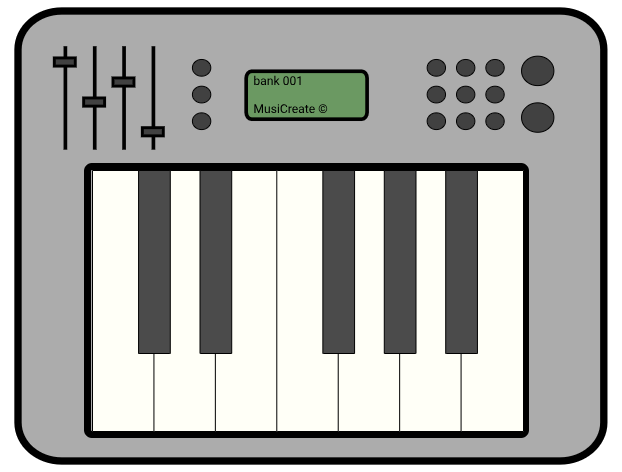

# MusiCreate

An interactive virtual piano that lets you play, record, and replay music using a variety of instruments. This project features a user-friendly interface, a metronome for rhythm practice, and customizable tempos for replaying compositions.


## Features

- **Play music:** Interact with the piano keys either by clicking on the virtual keyboard or using specific keyboard shortcuts.
- **Record and replay:** Capture your compositions and play them back at different tempos.
- **Instrument selection:** Choose from multiple instruments like piano, guitar, flute, and bass to personalize your sound.
- **Metronome:** A built-in metronome ensures you stay in rhythm while practicing or recording.

## Installation

1. Clone the repository:
    ```bash
    git clone https://github.com/NathanRouille/Musicreate.git
    ```
2. Navigate to the project directory:
    ```bash
    cd MusiCreate
    ```
3. Open `main.html` in your web browser to start using the application.

## Usage

### Playing Music
- Click on the virtual piano keys to produce sounds.
- Alternatively, use the following keyboard shortcuts:

#### White Keys:
| Note | Key  |
|------|------|
| C    | S    |
| D    | D    |
| E    | F    |
| F    | G    |
| G    | H    |
| A    | J    |
| B    | K    |

#### Black Keys:
| Note  | Key  |
|-------|------|
| C#    | E    |
| D#    | R    |
| F#    | Y    |
| G#    | U    |
| A#    | I    |

### Recording and Playback
- Press the **Record** button to capture your composition : 
- Press the **Play** button to replay it at the selected tempo : 
- Use the **Clear** button to erase the current recording : 

### Customization
- Select an instrument from the dropdown menu.
- Choose a tempo using the BPM (Beats Per Minute) selector : 

## Contributing

Contributions are welcome! If you find any issues or have suggestions for improvement, feel free to open an issue or submit a pull request.
